# Contributing to Project

## Getting Started

Before you start contributing, please refer to [SETUP.md](SETUP.md)

## Style Guide

- **Documentation**: Ensure that your code is well-documented. Use clear and descriptive comments to explain the purpose of functions, methods, and classes.
- **Variable Naming**: Use descriptive and meaningful names for variables, functions, and classes.
- **Formatting**: Use consistent formatting for code blocks, indentation, and spacing. Make sure your code is easy to read and understand.
- **Testing**: Write unit tests for new features or changes whenever possible. Ensure that all tests pass before submitting your changes.

Prettier is used in this project to ensure proper format and style; however, you must still adhere to the following styles that Prettier does not take account of. 
Please adhere to the following [style guide](https://github.com/google/styleguide) when making contributions to the project:

- [Style Guide for JSON](https://google.github.io/styleguide/jsoncstyleguide.xml)
  - Key Takeaways
    - Property Names/Keys should be wriiten in camelCase
- [Style Guide for JavaScript](https://google.github.io/styleguide/jsguide.html)
  - Key Takeaways
    - Classes should be written in PascalCase
    - Variable Names & Module Imports should be written in camelCase
    - Functions should be written in camelCase with the first word being an action
    - File names should be written in snake_case
    - Use const where possible
    - Limit the use of var to prevent unintended usage
    - Have the Initial Bracket \{ be on the first line of the for, while, if, etc.
- [Style Guide for HTML/CSS](https://google.github.io/styleguide/htmlcssguide.html)
  - Key Takeaways
    - Use "https://" rather than "http://" or "//" where applicable
    - Elements, Class, IDs should be written in kebab-case
    - Best Practice is to have one CSS file exclusively for each HTML File
- [Style Guide for MongoDB](https://www.mongodb.com/docs/meta/style-guide/)
  - Key Takeaways
  - Databases should be written in snake_case
  - Collections, Docuements, and Elements should be written in camelCase
  - Dates
    - Specific Times
      - Should be done in UTC Format as a Date Object 
        "ISODate(YYYY-MM-DDTHH:mm:ss.sssZ)"
        "ISODate(YYYY-MM-DDTHH:mm:ss.sss-hh:mm)"
      - Where:
        | | | | |
        | ------------ | ------------ | ------------------ | ------------ |
        | Year (YYYY) | Month (MM) | Day (DD) | Hours (HH) | Minutes (mm) |
        | Minutes (mm) | Seconds (ss) | Milliseconds (sss) | Timezone (Z) |
        | Hour Offset (hh)| Minute Offset (2nd mm)||
    - Calander Date / Range
      - Should be done as a String as the following 
      - Assume that Years, Months, and Dates used in Ranges are Inclusive
        - "YYYY-MM-DD to YYYY-MM-DD"
        - "YYYY-MM-DD"
        - "YYYY-MM to YYYY-MM"
        - "YYYY-MM"
        - "YYYY to YYYY"
        - "YYYY"

## Making Changes through Issues & Pull Request

Describe issues and pull request
Instructsions below are tailored to GitHub Desktop

### Overview

Last Project, we decided to create individual branches with our names and worked from there. Although this did work, there were issues with other group members understanding what other members were working on (Since all they can see is ricky-branch and not what features Ricky is working on).

Additionally, we also decided to just merge directly into main when we finished our work. Although this did work, this isn’t the standard and could lead to the main branch breaking due to lack of checks and peer review. 
To fix these above problems, we will be using Issues & Pull Request

### Pull Request Explanation

Pull Request is fairly like Merge with an extra layer of peer checking. Instead of immediately merging to main, you will send a Request instead. 
It will then run some tests as well as wait for other group member’s approval before the merge is complete.

### Issue Explanation

Issues in GitHub can be viewed as a To-Do List that is found in GitHub. There are issues that we create, and we can link or create a new branch to show that the issue is being worked on.

Issues are found in our repository on the GitHub website under the Issue Tab 
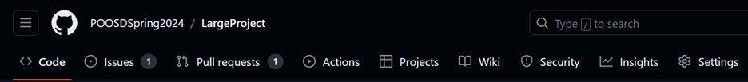

You can create new issues as well as look at other issues, as well as what branch the issue is being worked on under the Development Section 
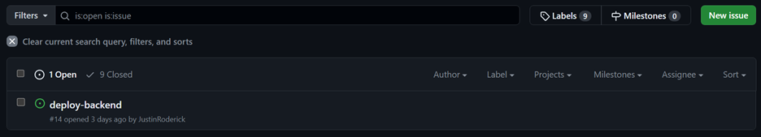 
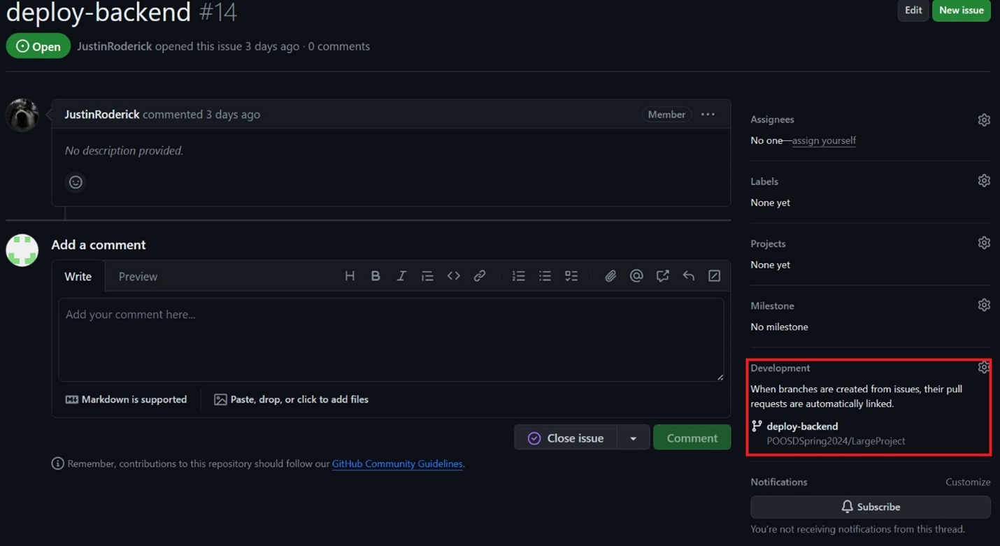

### Workflow with Issues, Pull Request, and GitHub Desktop

Before beginning, you do not have to use GitHub Desktop. If you can use Git or another Software WHILE ALSO using Issues and Pull Requests, then that is perfectly fine.

GitHub Desktop **CAN** be substituted 
Issues and Pull Requests **MUST** be used.

Note that the example Workflow will be using my own GitHub Repository “CI-CD-with-Digital-Ocean,” you would obviously be doing this in our actual project.

### Creating/Finding an Issue

Say that we want to work on a feature. First, we need to go to GitHub to check if the issue is already made.

1. On GitHub Desktop’s Top Taskbar, go to “Repository”>”View on GitHub” (Alternatively just go to the GitHub Repo) 
   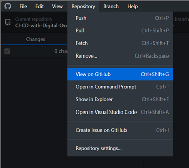

2. Go to the Issue Tab and you will see Open Issues along with the Issue and the Assignee 
   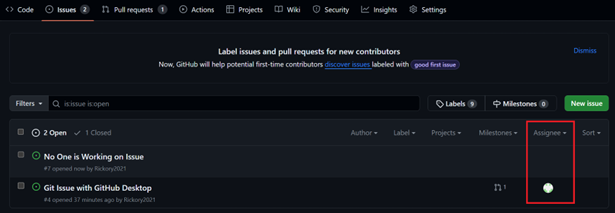 
   If there feature that you want to work on is there an no one is assigned to it use that issue. 
   Otherwise just create a new Issue

3. Once you have an issue, assign yourself to it and create a new branch to work on that issue.
   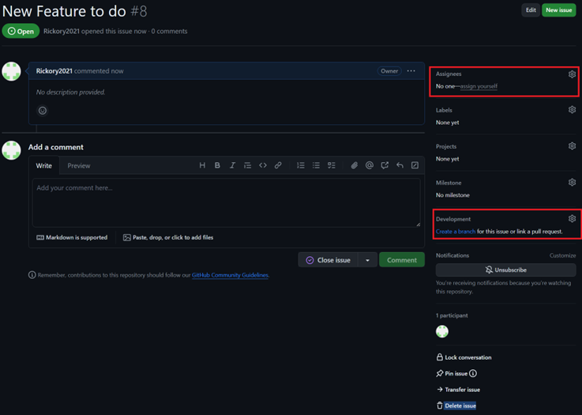 
   Since we are using GitHub Desktop, we will “Open branch with GitHub Desktop.”
   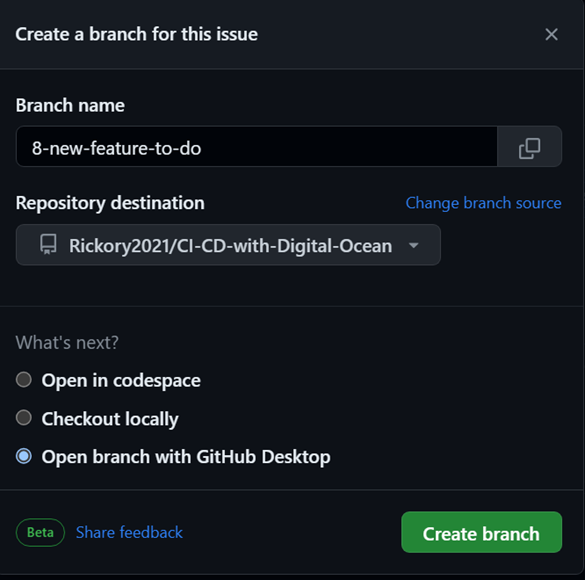 
   Just to make sure that you are on the right branch, check the Current Branch and ensure that you are working on the right branch 
   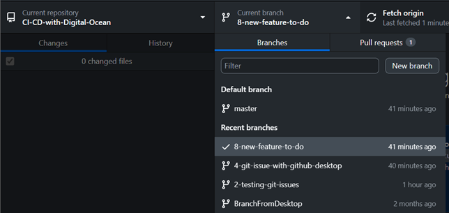 
   Afterwards, you then begin to work on the feature.

### Making a Pull Request

After making the issue and working on the new issue branch that was created, there will be a time where it is time to merge into main; however, main may of already updated and there would be a chance that your code unintentionally breaks the code without you noticing. 
So, it is time to ensure that no issues happen.

1. Make sure that the main branch and yours are up to date. This is done by sampling going to the branch and spamming the Fetch origin Button. 
   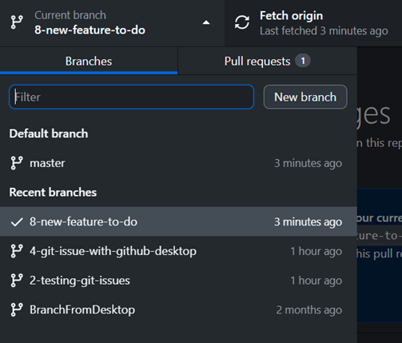

2. Once everything is up to date, we will now make sure that the branch you are working on (This example is 8-new-feature-to-do) by going to “Branch”>”Update to master” (master is essential main) 
   

3. If you update to master without problem, that means that there were no conflicts/funky changes between main and your branch. 
   On the other case, you may have conflicts before Merge. 
   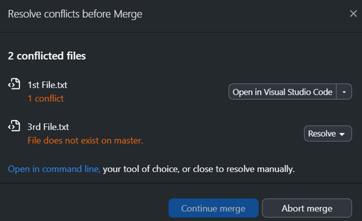 
   In the Example:

   - 1st File.txt typically happens when edits on the same file from main and your branch that are hard to determine which is right. This can be resolved by Opening in VSCode 
     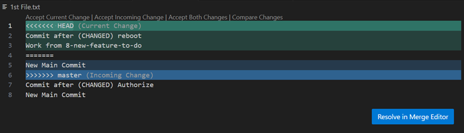 
     VSCode and GitHub Desktop is nice to us by merging but the edits from main and our branch in one file. 
     Use the “Resolve in Merge Editor” and you can see the differences and make the final version at the bottom
     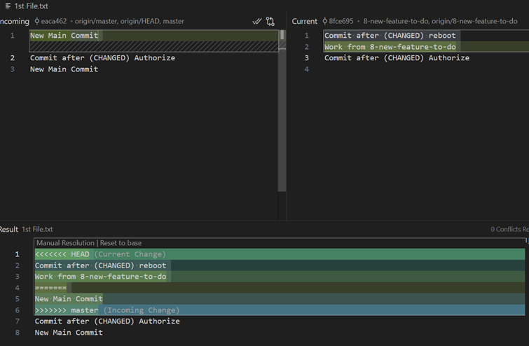 
     You then edit the 1st File.txt into proper “code” and then save. 
     Essentially, you are looking at the modifications from main and your branch and choosing the final version of that file. 
     Once done, “Complete the Merge” and that issue would be resolve.

   - 3rd File.txt typically happens when for the same file, one branch edited it while the other branch deleted it. 
     To Resolve this, look at the dropdown and determine whether that file should be kept (With the edited parts) or deleted.
     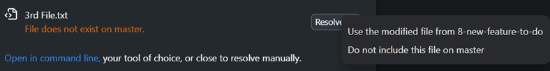

   Once finished, you can the “continue merge” 
   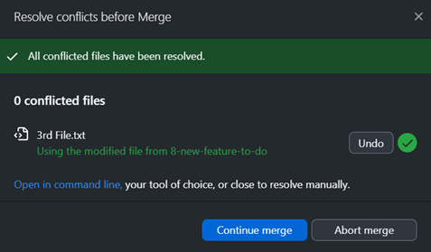

4. After the merge is complete, you could run the program and check if everything is working properly. If everything looks good, then you can “Push to Origin” to have the merge appear on GitHub.

5. Now, what you just did earlier was update your branch to the recent main branch. 
   We want to have our feature be on the main branch, not just updating our issue branch. 
   To do this, go to “Branch” > ”Create Pull Request” 
   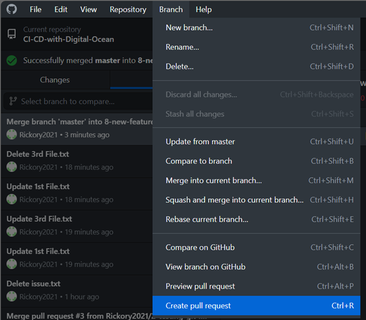 
   It will then open GitHub Website with a Pull Request. Fill out the description if needed and Create the Pull Request 
   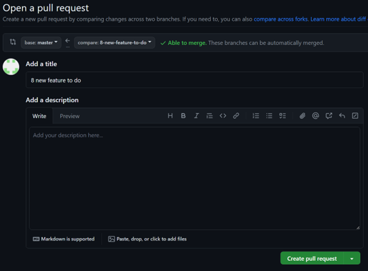

6. Once the Pull Request is created, checks will be made and you will be given this page:
   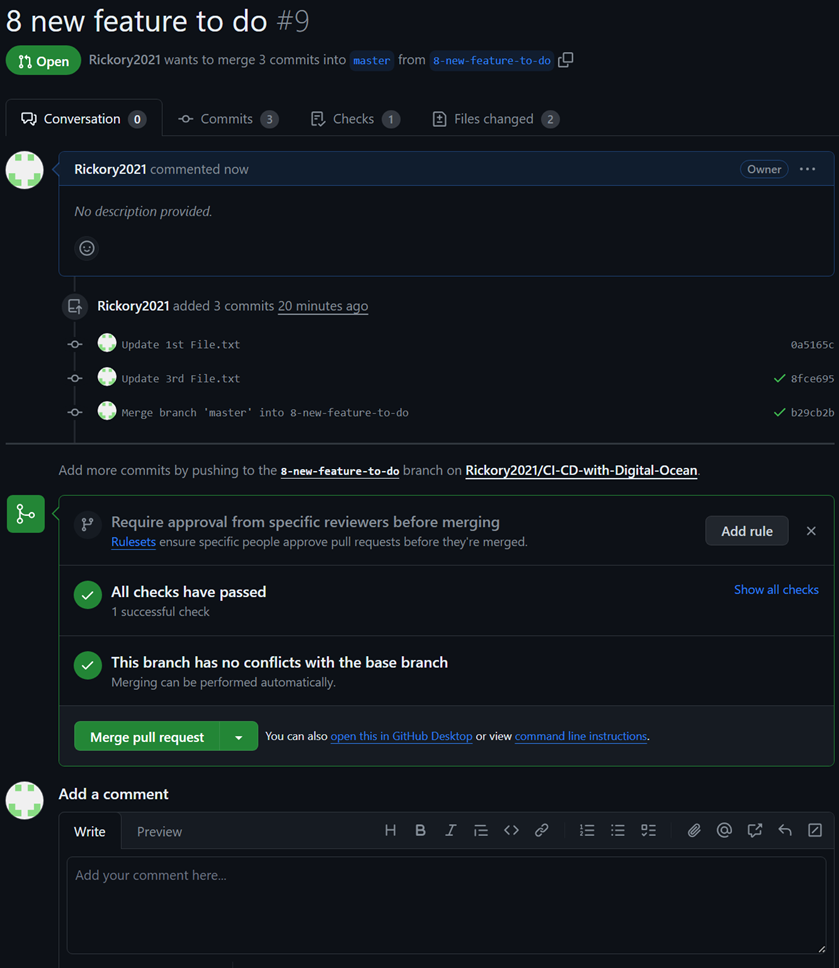 
   Now, you have to let someone else know that the pull request is made so they can double check it. 
   Once everything is in order, they will click “Merge pull request”

7. After the pull request is finished, delete the branch since it is now done. 
   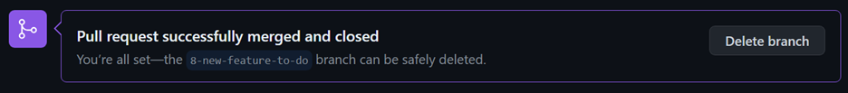
